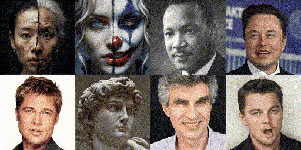

# MEMO

**MEMO: Memory-Guided Diffusion for Expressive Talking Video Generation**
<br>
[Longtao Zheng](https://ltzheng.github.io)\*,
[Yifan Zhang](https://scholar.google.com/citations?user=zuYIUJEAAAAJ)\*,
[Hanzhong Guo](https://scholar.google.com/citations?user=q3x6KsgAAAAJ)\,
[Jiachun Pan](https://scholar.google.com/citations?user=nrOvfb4AAAAJ),
[Zhenxiong Tan](https://scholar.google.com/citations?user=HP9Be6UAAAAJ),
[Jiahao Lu](https://scholar.google.com/citations?user=h7rbA-sAAAAJ),
[Chuanxin Tang](https://scholar.google.com/citations?user=3ZC8B7MAAAAJ),
[Bo An](https://personal.ntu.edu.sg/boan/index.html),
[Shuicheng Yan](https://scholar.google.com/citations?user=DNuiPHwAAAAJ)
<br>
_[Project Page](https://memoavatar.github.io) | [arXiv](https://arxiv.org/abs/2412.04448) | [Model](https://huggingface.co/memoavatar/memo)_

This repository contains the example inference script for the MEMO-preview model. The gif demo below is compressed. See our [project page](https://memoavatar.github.io) for full videos. Also, check out the community contributions, including a [ComfyUI integration](https://github.com/if-ai/ComfyUI-IF_MemoAvatar/tree/main), [Gradio app](https://github.com/camenduru/memo-tost/blob/main/worker_runpod_gradio.py), [demo](https://x.com/camenduru/status/1865102599591976961), and [Jupyter notebook](https://github.com/camenduru/memo-jupyter).

<div align="center">
    
</div>

## Installation

```bash
conda create -n memo python=3.10 -y
conda activate memo
conda install -c conda-forge ffmpeg -y
pip install -e .
```

> Our code will download the checkpoint from Hugging Face automatically, and the models for face analysis and vocal separation will be downloaded to `misc_model_dir` of `configs/inference.yaml`. If you want to download the models manually, please download the checkpoint from [here](https://huggingface.co/memoavatar/memo) and specify the path in `model_name_or_path` of `configs/inference.yaml`.

## Inference

```bash
python inference.py --config configs/inference.yaml --input_image <IMAGE_PATH> --input_audio <AUDIO_PATH> --output_dir <SAVE_PATH>
```

For example:

```bash
python inference.py --config configs/inference.yaml --input_image assets/examples/dicaprio.jpg --input_audio assets/examples/speech.wav --output_dir outputs
```

> We tested the code on H100 and RTX 4090 GPUs using CUDA 12. Under the default settings (fps=30, inference_steps=20), the inference time is around 1 second per frame on H100 and 2 seconds per frame on RTX 4090. We welcome community contributions to improve the inference speed or add more features.

## Acknowledgement

Our work is made possible thanks to high-quality open-source talking video datasets (including [HDTF](https://github.com/MRzzm/HDTF), [VFHQ](https://liangbinxie.github.io/projects/vfhq), [CelebV-HQ](https://celebv-hq.github.io), [MultiTalk](https://multi-talk.github.io), and [MEAD](https://wywu.github.io/projects/MEAD/MEAD.html)) and some pioneering works (such as [EMO](https://humanaigc.github.io/emote-portrait-alive) and [Hallo](https://github.com/fudan-generative-vision/hallo)).

## Ethics Statement

We acknowledge the potential of AI in generating talking videos, with applications spanning education, virtual assistants, and entertainment. However, we are equally aware of the ethical, legal, and societal challenges that misuse of this technology could pose. To reduce potential risks, we have only open-sourced a preview model for research purposes. Demos on our website use publicly available materials. We welcome copyright concerns—please contact us if needed, and we will address issues promptly. Users are required to ensure that their actions align with legal regulations, cultural norms, and ethical standards. It is strictly prohibited to use the model for creating malicious, misleading, defamatory, or privacy-infringing content, such as deepfake videos for political misinformation, impersonation, harassment, or fraud. We strongly encourage users to review generated content carefully, ensuring it meets ethical guidelines and respects the rights of all parties involved. Users must also ensure that their inputs (e.g., audio and reference images) and outputs are used with proper authorization. Unauthorized use of third-party intellectual property is strictly forbidden. While users may claim ownership of content generated by the model, they must ensure compliance with copyright laws, particularly when involving public figures' likeness, voice, or other aspects protected under personality rights.

## Citation

If you find our work useful, please use the following citation:

```bibtex
@article{zheng2024memo,
  title={MEMO: Memory-Guided Diffusion for Expressive Talking Video Generation},
  author={Zheng, Longtao and Zhang, Yifan and Guo, Hanzhong and Pan, Jiachun and Tan, Zhenxiong and Lu, Jiahao and Tang, Chuanxin and An, Bo and Yan, Shuicheng},
  journal={arXiv preprint arXiv:2412.04448},
  year={2024}
}
```

## Star History

<div align="center">
    <a href="https://star-history.com/#memoavatar/memo&Timeline">
        
    </a>
</div>
